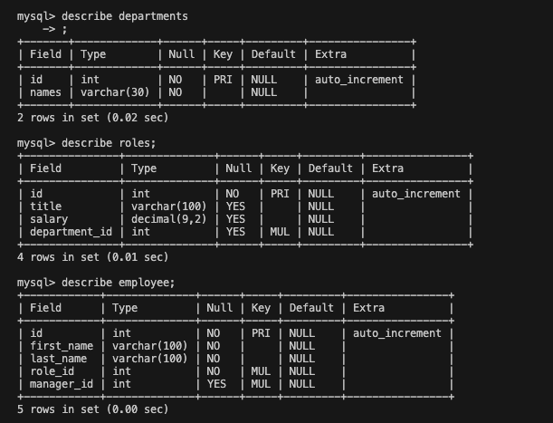
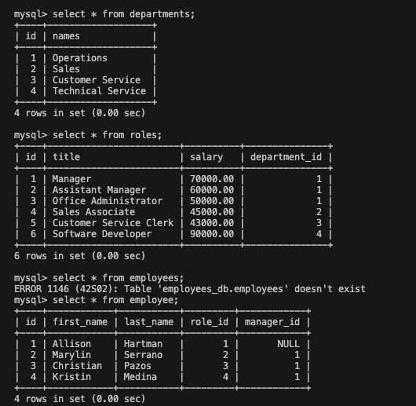
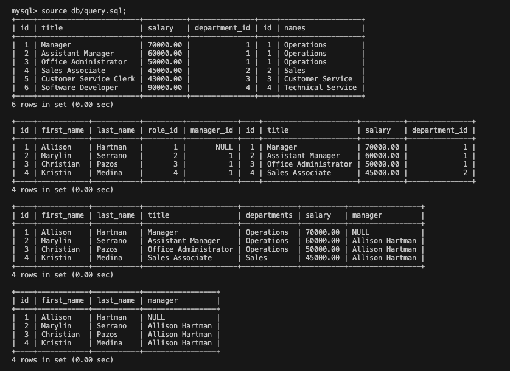

# Employee Data Tracker

## Description
The user of this application can use it to view departments, roles and current employees. They can also add departments, roles and employee's and update existing employee's.
When using this application the user will be prompted with questions and will be prompted to select from their choices or input new information depending on what they select. 

## User Story
AS A business owner
I WANT to be able to view and manage the departments, roles, and employees in my company
SO THAT I can organize and plan my business

## Acceptance Criteria
GIVEN a command-line application that accepts user input
WHEN I start the application
THEN I am presented with the following options: view all departments, view all roles, view all employees, add a department, add a role, add an employee, and update an employee role
WHEN I choose to view all departments
THEN I am presented with a formatted table showing department names and department ids
WHEN I choose to view all roles
THEN I am presented with the job title, role id, the department that role belongs to, and the salary for that role
WHEN I choose to view all employees
THEN I am presented with a formatted table showing employee data, including employee ids, first names, last names, job titles, departments, salaries, and managers that the employees report to
WHEN I choose to add a department
THEN I am prompted to enter the name of the department and that department is added to the database
WHEN I choose to add a role
THEN I am prompted to enter the name, salary, and department for the role and that role is added to the database
WHEN I choose to add an employee
THEN I am prompted to enter the employee’s first name, last name, role, and manager, and that employee is added to the database
WHEN I choose to update an employee role
THEN I am prompted to select an employee to update and their new role and this information is updated in the database

## Installation Process
- Run npm start on the terminal to be prompted into creating a package.json file.
- Add inquirer and mySQL as dev dependencies.
- Run npm i on the terminal to install all of your packages.
- Run npm start on the terminal to start your application.

## Video Link
Application walkthrough:

## Successes and Challenges
Majority of the success on this project was being able to set up my databases with no issues. I found myself really enjoying mySQL and getting the foundation of the project going. I did have to do some research on Google to figure out what aliases are and how to implement them when I'm trying to combine data into one table. Another success was getting the functions view Departments, Roles and Employees to work, creating these functions and seeing them work the way they are supposed to with little trouble was very rewarding. A challenge I faced was creating the add a new role function because there was more data to find and input, I was getting stuck on selecting a department for the new role because I was getting a lot of undefined messages and eventually fixed this issue. Something that I also learned was that you have to pay attention to the input values that you have initially set up and making sure that you're entering the right format for that value. 

## Setting up the database 

## Future Development
I would like to edit the salaries in the future because based on what I have seen in the real world someone can stay in the same position for years and their salary could increase.

## Credits
I would like to give credit to my instructor Rommel and TA Ringo for teaching me how to use mySQL, my tutor Anothony for helping overcome some issues that I was encountering that involved merging data and Thomas Calle's repository and walk through video that I used to better understand the logic of piecing a project like this together. 

